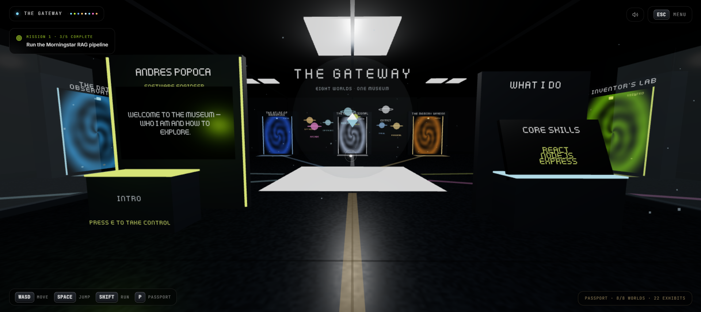

  

  

  
  
  
  
  
  
  

## 🪐 About Me

I'm a Computer Science student at the University of Illinois Chicago, concentrating in Software Engineering and graduating in May 2027. I recently completed a Software Engineering internship at Morningstar in Chicago, where I worked with the Data Science Services team to help build a production RAG platform. I'm also an AI Fellow with the Handshake AI Fellowship, focused on LLM evaluation and adversarial prompt authoring.

My curiosity started with wondering how video games worked. Later, the Ventra app showed me when my bus would arrive, and I realized that someone had built software that made my day easier. That is still what motivates me: creating technology with tangible, real-world impact.

  
    
  
  
   
  
  
   
  
  

## 🛰️ Tech Stack

  
<strong>Languages</strong>

  

  
<strong>Frontend</strong>

  

  
<strong>Backend &amp; Data</strong>

  

  
<strong>Cloud &amp; Infrastructure</strong>

  

## 🌌 Enter The Gateway

Step into **The Gateway**, my interactive 3D portfolio museum. Explore eight distinct worlds containing my experience, skills, and work—the museum itself is part of the portfolio. Click the image to enter and explore it for yourself.

  
   
  

## 📡 GitHub Activity

  
  
   
  
   
  

  <picture>
    <source media="(prefers-color-scheme: dark)" srcset="https://raw.githubusercontent.com/majorandres/majorandres/output/github-snake-dark.svg" />
    <source media="(prefers-color-scheme: light)" srcset="https://raw.githubusercontent.com/majorandres/majorandres/output/github-snake.svg" />
    
  </picture>

## 👨‍🚀 Connect With Me

  
  
  
   
  
  
  

